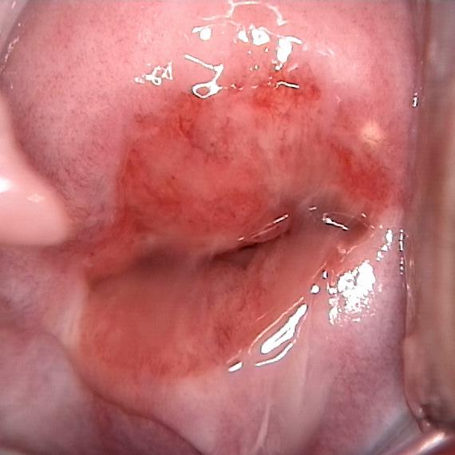
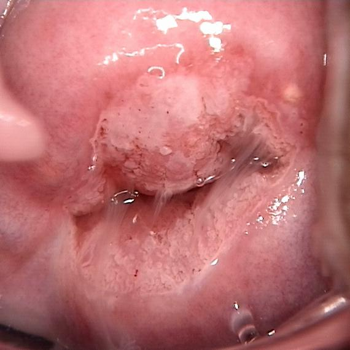
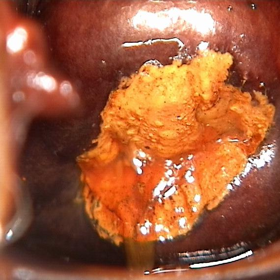

# Recognition of High-grade Squamous Intraepithelial Lesion
This repository includes the implementation of a classification system of HSIL (High-grade Squamous Intraepithelial Lesion) based on CNN architectures.

## Introduction

High-grade squamous intraepithelial lesion (HSIL or HGSIL) indicates moderate or severe cervical intraepithelial neoplasia or carcinoma in situ. It is usually diagnosed following a Pap test. In some cases these lesions can lead to invasive cervical cancer, if not followed appropriately.[1]

Pap test will generate three types of images as follows:

<div  align="center">    
  
</div>

We focus on classificaiton of  the above three types of colposcope images from Pap test using the method of deep learning. 

## Requirements

- Python (3.5.2)
- Keras (2.0.5)
- tensorflow (1.4.0)

## Manual

* Train
```
python train.py config.yaml
```

* Predict

```
python predict.py image.jpg
```

## References and papers

- **Vgg19 Network**
    -  [Very Deep Convolutional Networks for Large-Scale Image Recognition][2]
- **Residual Network**
    -  [Deep Residual Learning for Image Recognition][3]
    -  [Identity Mappings in Deep Residual Networks][4]
- **Wide Residual Network**
    -  [Wide Residual Networks][5]
- **ResNeXt**  
    -  [Aggregated Residual Transformations for Deep Neural Networks][6]
- **DenseNet**
    -  [Densely Connected Convolutional Networks][7]


[1]: https://en.wikipedia.org/wiki/Bethesda_system
[2]: https://arxiv.org/abs/1409.1556
[3]: https://arxiv.org/abs/1512.03385
[4]: https://arxiv.org/abs/1603.05027
[5]: https://arxiv.org/abs/1605.07146
[6]: https://arxiv.org/abs/1611.05431
[7]: https://arxiv.org/abs/1608.06993
